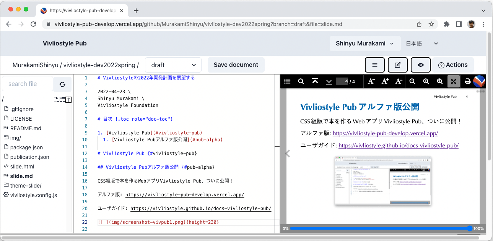
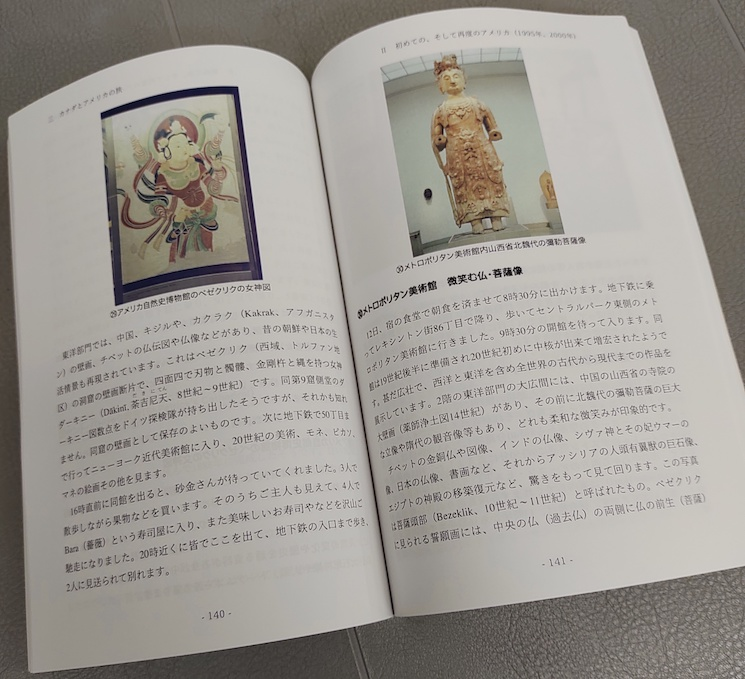
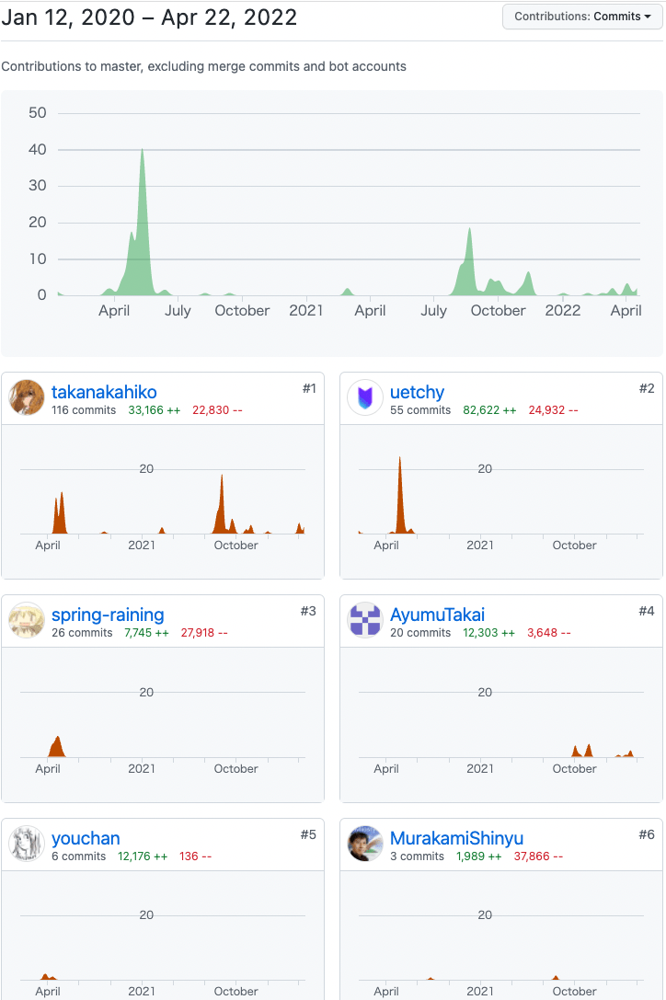
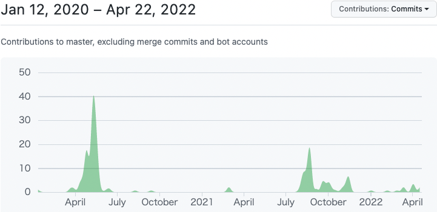

# Vivliostyleの2022年開発計画を展望する {style="letter-spacing: -0.02em"}

2022-04-23 \
Shinyu Murakami \
Vivliostyle Foundation

# 目次 {.toc role="doc-toc"}

1. [Vivliostyle Pub](#vivliostyle-pub)
  1. [Vivliostyle Pubアルファ版公開](#pub-alpha)

# Vivliostyle Pub {#vivliostyle-pub}

## Vivliostyle Pubアルファ版公開 {#pub-alpha}

CSS組版で本を作るWebアプリVivliostyle Pub、ついに公開！

アルファ版: https://vivliostyle-pub-develop.vercel.app/

ユーザーガイド: https://vivliostyle.github.io/docs-vivliostyle-pub/

{height=200}

## Vivliostyle Pubでできること

- 無料、インストール不要、Webブラウザだけで本が作れる
- 組版結果をプレビュー確認しながら執筆・編集ができる
- 簡易なマークダウン記法で原稿が書ける
  - [VFM (Vivliostyle Flavored Markdown)](https://vivliostyle.github.io/vfm/#/ja/vfm)
- ページデザインは、テーマから選べる
  - 既存テーマをカスタマイズしたり自分でCSS書いてもよい
- Webフォント対応
- GitHub利用。原稿変更履歴がGitHubに保存される
- 多数の原稿からなる出版物制作、その共同編集作業も可能
- PDF出力、Web出版物(WebBook)、EPUB生成（予定）

## アルファ版の主な制限と、今後の開発

まだアルファ版なので出来てない機能や制限が多々あります。  
以下は、今はまだないけれど今後開発予定の機能の主なもの

- スタイル・テーマの設定、カスタマイズ機能
- 目次作成を簡単に
- 表紙の作成を簡単に
- プレビューをファイル単位でなく出版物全体でも可能に
- プレビューをページ表示とスクロール表示の切り替え可能に
- 印刷用PDFと閲覧用PDFなど、目的別のPDF出力の設定
- EPUB生成機能、EPUBやWeb出版物での作品公開を簡単に
- 出版物メタデータの設定・編集機能

## Vivliostyle Pubで作った本の印刷製本には

Vivliostyle Pubで作った本の印刷製本がスムーズにできるよう、印刷製本サービスの[mybooks POD](https://pod.mybooks.jp/)<small>（欧文印刷株式会社）</small>と提携。

{height=150}

- Vivliostyle Pubから提携先サービスに繋げるようにする予定
- 印刷製本、電子書籍配信等、提携に関心あればご連絡下さい

## Vivliostyle Pubの開発貢献者たちに感謝！

Vivliostyleの他のプロジェクトと同様、Vivliostyle Pubはオープンソースでボランティアの開発貢献者たちで開発されてます。

{height=330 style="float: right; margin-bottom: -50px"}

開発協力者募集中！

- [Vivliostyle PubのContributorsをGitHubで見る](https://github.com/vivliostyle/vivliostyle-pub/graphs/contributors)

{height=160 style="margin-left: 0"} 

# 